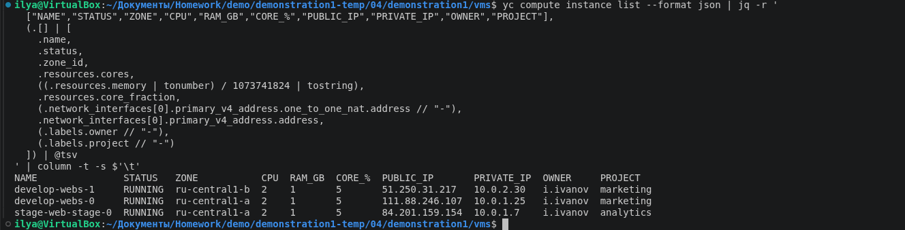
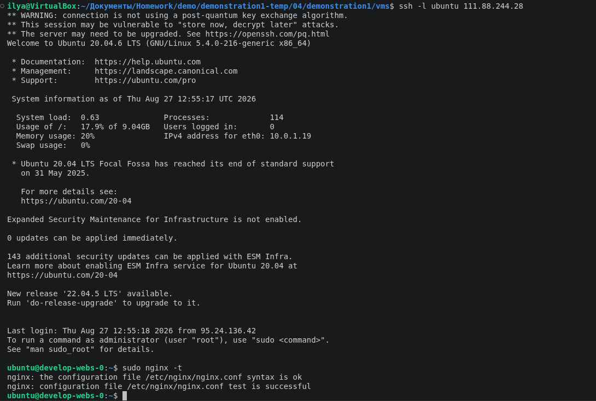
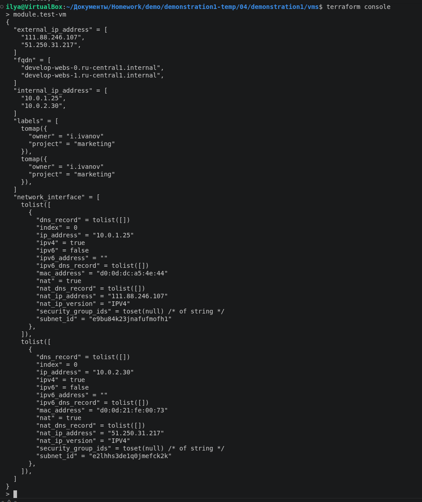
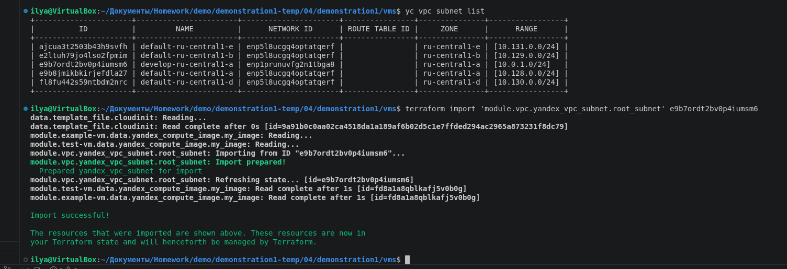
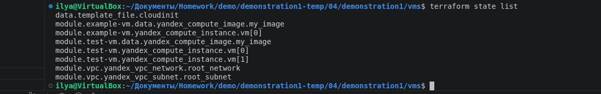
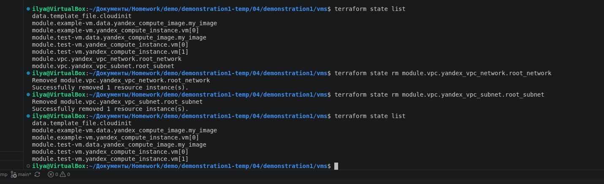
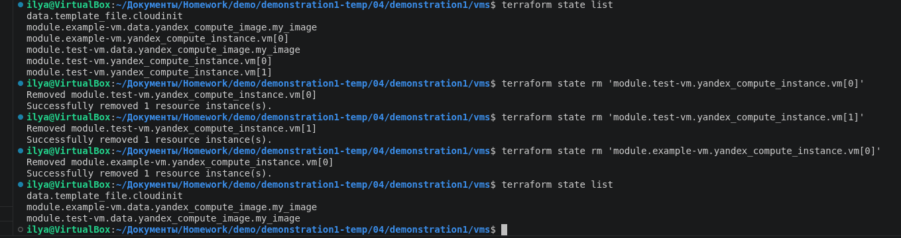
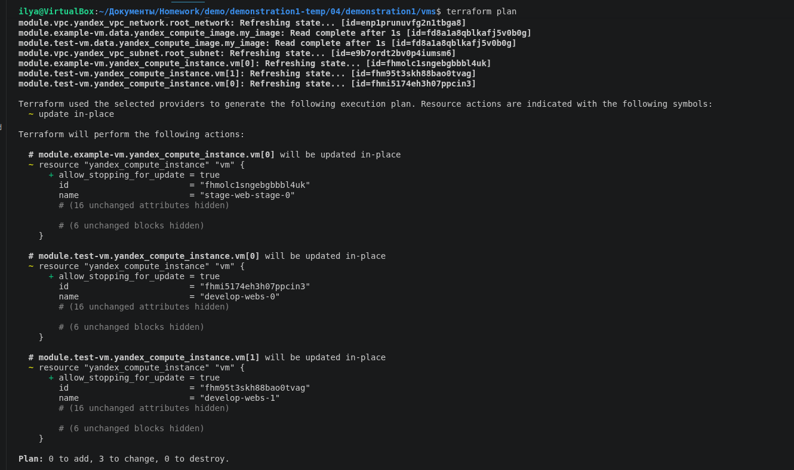

# Домашнее задание «Terraform. Yandex Cloud»

| | |
|---|---|
| **Студент** | Демин Илья Викторович |
| **GitHub репозиторий** | https://github.com/deminilyadev-maker/terraform-04.git |

---

# Оглавление

- [Задание 1](#задание-1)
- [Задание 2](#задание-2)
- [Задание 3](#задание-3)

---

# Задание 1

## Шаг 1. Создание двух ВМ с помощью remote-модуля

В соответствии с заданием был использован готовый код из демонстрации для создания двух виртуальных машин с помощью двух вызовов `remote`-модуля.

Виртуальные машины относятся к разным проектам:

- `marketing`;
- `analytics`.

Для обозначения принадлежности используются `labels`.

В `cloud-init.yml` передаётся SSH-ключ, а значение SSH-ключа передаётся в функцию `templatefile`.

---

## Шаг 2. Установка nginx

В файл `cloud-init.yml` была добавлена установка nginx.

Таким образом, при создании виртуальных машин установка веб-сервера выполняется автоматически через `cloud-init`.

---

## Шаг 3. Проверка ВМ и модуля

Для проверки созданных ресурсов использовалась команда:

```bash
yc compute instance list
```

В результате были получены созданные виртуальные машины Yandex Cloud.

### Скриншот



Для проверки работы nginx на виртуальной машине была выполнена команда:

```bash
sudo nginx -t
```

### Скриншот



Также через `terraform console` была проверена информация, возвращаемая модулем.

### Скриншот



---

# Задание 2

## Шаг 1. Создание локального модуля VPC

Был создан локальный модуль `vpc`, который создаёт два ресурса:

- одну сеть `yandex_vpc_network`;
- одну подсеть `yandex_vpc_subnet`.

Модуль принимает следующие параметры:

- имя сети;
- окружение;
- зону;
- `v4_cidr_blocks`.

Пример вызова:

```hcl
module "vpc_dev" {
  source   = "./vpc"
  env_name = "develop"
  zone     = "ru-central1-a"
  cidr     = "10.0.1.0/24"
}
```

---

## Шаг 2. Передача переменных в модуль

Вызов модуля выполняется с передачей имени сети, зоны и диапазона адресов:

```hcl
source   = "./vpc"
env_name = "develop"
zone     = "ru-central1-a"
cidr     = "10.0.1.0/24"
```

Таким образом, модуль является переиспользуемым и позволяет создавать VPC с различными параметрами.

---

## Шаг 3. Возврат информации через output

В модуле были добавлены `output`, возвращающие информацию о созданных ресурсах:

```hcl
output "network_id" {
  value = yandex_vpc_network.root_network.id
}

output "subnet_id" {
  value = yandex_vpc_subnet.root_subnet.id
}
```

Полученные значения используются в корневом модуле Terraform.

### Скриншот


---

## Шаг 4. Замена ресурсов VPC локальным модулем

Ресурсы:

```text
yandex_vpc_network
yandex_vpc_subnet
```

были заменены вызовом созданного локального модуля `vpc`.

Для проверки существующих подсетей использовалась команда:

```bash
yc vpc subnet list
```

В результате была найдена подсеть:

```text
develop-ru-central1-a
```

с диапазоном:

```text
10.0.1.0/24
```

### Скриншот



---

## Шаг 5. Генерация документации

Для локального модуля была сгенерирована документация с помощью `terraform-docs`.

Документация содержит описание входных переменных и выходных значений модуля.

---

# Задание 3

## Шаг 1. Просмотр ресурсов в Terraform state

Перед удалением модулей был выведен список ресурсов Terraform state:

```bash
terraform state list
```

В state находились ресурсы виртуальных машин и VPC:

```text
module.example-vm.yandex_compute_instance.vm[0]
module.test-vm.yandex_compute_instance.vm[0]
module.test-vm.yandex_compute_instance.vm[1]
module.vpc.yandex_vpc_network.root_network
module.vpc.yandex_vpc_subnet.root_subnet
```

### Скриншот



---

## Шаг 2. Удаление модуля VPC из state

Модуль VPC был полностью удалён из Terraform state без удаления соответствующих ресурсов из Yandex Cloud.

Для удаления использовались команды:

```bash
terraform state rm 'module.vpc.yandex_vpc_network.root_network'
```

```bash
terraform state rm 'module.vpc.yandex_vpc_subnet.root_subnet'
```

### Скриншот



---

## Шаг 3. Удаление модулей VM из state

Модули виртуальных машин также были удалены из Terraform state без удаления самих виртуальных машин из Yandex Cloud.

Для удаления использовались команды:

```bash
terraform state rm 'module.example-vm.yandex_compute_instance.vm[0]'
```

```bash
terraform state rm 'module.test-vm.yandex_compute_instance.vm[0]'
```

```bash
terraform state rm 'module.test-vm.yandex_compute_instance.vm[1]'
```

### Скриншот



---

## Шаг 4. Импорт ресурсов обратно и проверка plan

После удаления ресурсов из state было проверено, что сами ресурсы продолжают существовать в Yandex Cloud.

Затем ресурсы были импортированы обратно в Terraform state.

Пример импорта подсети:

```bash
terraform import 'module.vpc.yandex_vpc_subnet.root_subnet' e9b7ordt2bv0p4iumsm6
```

Пример импорта виртуальной машины:

```bash
terraform import 'module.test-vm.yandex_compute_instance.vm[0]' fhmi5174eh3h07ppcin3
```

Вторая виртуальная машина была импортирована с её фактическим ID:

```bash
terraform import 'module.test-vm.yandex_compute_instance.vm[1]' fhm95t3skh88bao0tvag
```

После импорта был проверен Terraform state:

```bash
terraform state list
```

Затем выполнена финальная проверка:

```bash
terraform plan
```

Итоговый результат:

```text
Plan: 0 to add, 3 to change, 0 to destroy.
```

Таким образом, Terraform не планирует создание или удаление ресурсов. Значимых изменений инфраструктуры нет.

### Скриншот



---

# Итог

В рамках домашнего задания были выполнены все три задания:

- созданы две ВМ с помощью `remote`-модуля;
- настроен `cloud-init` и установка nginx;
- выполнена проверка ВМ и nginx;
- создан локальный модуль VPC;
- сеть и подсеть вынесены в локальный модуль;
- настроены `output` модуля;
- сгенерирована документация `terraform-docs`;
- ресурсы VPC и VM удалены из Terraform state без удаления из Yandex Cloud;
- ресурсы импортированы обратно;
- выполнен `terraform plan`;
- итоговый plan не содержит операций `add` и `destroy`, значимых изменений инфраструктуры нет.
